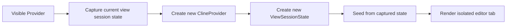
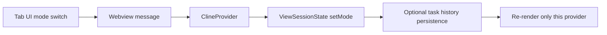
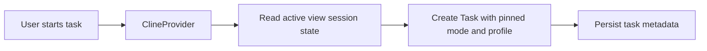

# Instance Isolation Architecture Plan

## Goal

Evolve the current mixed global and provider-local approach into a clean architecture where sidebar and editor tabs can coexist without leaking mode or active provider profile changes across instances, while preserving intentionally shared data such as secrets, profile registry, and task history.

## Problem Summary

Today the system mixes two concerns:

1. **Shared extension settings** stored through `ContextProxy` and VS Code global state.
2. **Per-view interaction state** such as active mode and active provider profile selection.

The recent minimal fix solved the visible bug by introducing local editor-tab overrides, but that leaves `ClineProvider` responsible for deciding whether a value is global or local based on `renderContext`. That works, but it is not the final architecture because the separation of concerns is implicit and distributed.

## Target Architecture

### State Layers

The architecture should explicitly split state into three layers.

#### 1. Global Persistent State

Owned by `ContextProxy`.

This layer keeps only values that are intentionally shared across the whole extension and should survive reloads:

- secrets and API keys
- provider profile registry
- custom modes definitions
- task history
- global feature flags and general UX settings
- mode-to-default-profile mapping

This layer should **not** store the currently selected mode or currently selected active profile for a particular visible chat instance.

#### 2. View Session State

Owned by a new view-scoped state object, one per `ClineProvider` instance.

This layer represents selection state for one visible chat surface:

- active mode
- active provider profile name/id
- resolved provider settings snapshot for the current view
- optional future per-view UI filters and navigation state

This state may be initialized from global defaults, but after creation it is isolated from other views unless an explicit synchronization action is requested.

#### 3. Task Runtime State

Owned by `Task`.

This layer already mostly exists and should remain task-specific:

- task mode
  n- task api configuration name
- task conversation and tool execution state
- browser session state
- todo list

The main improvement is that task creation and task resume should consume state from the view session layer instead of reading shared global selection state directly.

## New Core Abstractions

### `ViewSessionState`

Introduce a dedicated class or interface, for example:

- `ViewSessionState`
- `ViewStateStore`
- `ClineViewSession`

Responsibilities:

- hold per-provider selection state
- expose getters and setters for active mode and active profile
- resolve effective provider settings for the view
- initialize from a source snapshot when a new tab is opened
- serialize only if later we want restorable tab sessions

Important rule:

`ClineProvider` should depend on this abstraction instead of directly branching on `renderContext` for state origin.

### `GlobalSettingsStore`

This can remain backed by `ContextProxy`, but conceptually the system should treat `ContextProxy` as a global persistent store only.

The key design change is not necessarily renaming it immediately, but reducing its responsibility to:

- persistent shared settings
- persistent shared registry data
- secrets

### `ProviderSelectionResolver`

Create a small service or internal helper that resolves which provider settings should be used in a given context:

- for a view without task: use `ViewSessionState`
- for a running task: use task-pinned provider configuration
- for history restore: initialize `ViewSessionState` from the history item first, then create/resume task

This avoids scattering this logic across multiple methods.

## Target Data Flow

### Open in Editor

### Mode Switch in a Tab

### Task Creation

## Required Refactoring Areas

### 1. `ClineProvider`

Refactor `ClineProvider` so it no longer decides state ownership with ad-hoc `renderContext === editor` checks spread through methods.

Target:

- one field like `viewSessionState`
- all mode/profile reads go through it
- all mode/profile writes go through it
- `getState` composes `global persistent state + view session state + current task state`

### 2. `registerCommands.openClineInNewTab`

Tab opening should clone the current **view session state**, not copy implicit values out of global state.

### 3. `createTaskWithHistoryItem`

History restore should:

- populate the destination view session state from the history item
- only then create the task
- never write restored mode/profile back into global shared selection state

### 4. `handleModeSwitch`

Split responsibilities currently combined in one method:

- update current view selection
- optionally persist task metadata
- optionally switch provider defaults for the current view

Mode switching should not implicitly mutate the shared extension-wide active selection.

### 5. Provider Profile Activation

Profile activation should support two distinct operations:

- **activate for current view**
- **update global default mapping**

These are different actions and should not be conflated.

## Migration Plan

### Phase 1: Introduce explicit view-state abstraction

- add `ViewSessionState`
- move current editor-local fields behind it
- keep current behavior unchanged
- replace direct access to local fields with the abstraction

### Phase 2: Route all selection reads through view state

- update `ClineProvider.getState`
- update `getStateToPostToWebview`
- update rules and system prompt related flows to use view session state

### Phase 3: Split profile and mode mutation APIs

- separate global default updates from current-view updates
- make task creation consume view session state explicitly
- make history restore initialize the view session instead of touching global shared selection

### Phase 4: Remove transitional branching

- eliminate most `renderContext` checks related to mode/profile ownership
- keep `renderContext` only for rendering or VS Code host behavior, not state semantics

### Phase 5: Optional future enhancement

If desired later, persist editor-tab session state for restoring multiple tabs after reload. This is optional and should only happen after the in-memory model is clean.

## Compatibility Strategy

To avoid breaking existing behavior:

- keep global persistent settings schema backward-compatible initially
- migrate `mode` and `currentApiConfigName` usage gradually, not necessarily delete keys immediately
- during transition, sidebar can continue seeding new view sessions from current global defaults
- old history items remain valid because task metadata already stores `mode` and `apiConfigName`

## Risks

### Semantic drift between task state and view state

If both remain writable without clear precedence, bugs will reappear.

Mitigation:

- define precedence explicitly:
    - task runtime state for running task internals
    - view session state for current selection in UI
    - global state only for defaults and shared settings

### Hidden coupling in provider activation

Several paths assume provider activation updates global state and mode mappings together.

Mitigation:

- split APIs into focused operations
- audit all callers of provider activation

### History resume regressions

Task reopening currently assumes global state mutation in some flows.

Mitigation:

- add focused tests for history restore in sidebar and editor contexts

### Telemetry assumptions

Telemetry may assume one global active mode/profile.

Mitigation:

- emit telemetry from effective view/task context instead of shared globals

## Validation Strategy

### Unit tests

Add dedicated tests for:

- sidebar and editor tab having different active modes simultaneously
- sidebar and editor tab having different active provider profiles simultaneously
- opening a new editor tab inherits from source tab once, then diverges
- history restore in editor tab does not modify sidebar selection
- task creation uses current view session values

### Integration tests

Add flows for:

- open sidebar, switch mode, open editor tab, switch editor mode, verify sidebar unchanged
- resume a history item in editor tab, verify another visible instance unchanged
- switch provider profile in editor tab, verify sidebar profile badge and system prompt source stay unchanged

### Type and contract validation

Ensure typed separation between:

- persistent shared settings shape
- view session shape
- task runtime shape

Avoid a single giant state object being used as the write target for all three layers.

## Suggested File-Level Direction

Likely main touchpoints:

- `src/core/webview/ClineProvider.ts`
- `src/activate/registerCommands.ts`
- `src/core/config/ContextProxy.ts`
- `src/core/task/Task.ts`
- `src/core/webview/webviewMessageHandler.ts`

Potential new files:

- `src/core/webview/ViewSessionState.ts`
- `src/core/webview/ProviderSelectionResolver.ts`

## Definition of Done

The architecture is in the correct state when all of the following are true:

- `ContextProxy` no longer acts as the active selection store for tabs
- `ClineProvider` reads mode/profile from a dedicated view session abstraction
- task creation and history restore consume view session state explicitly
- changing mode/profile in one visible instance does not affect another instance unless explicitly synchronized
- tests cover sidebar-editor coexistence and history restore isolation

## Recommendation

Treat the current shipped fix as **Phase 0**. It solved the user bug and reduced pressure. The next proper engineering step is to introduce `ViewSessionState` and migrate selection logic behind it, while preserving current external behavior.
